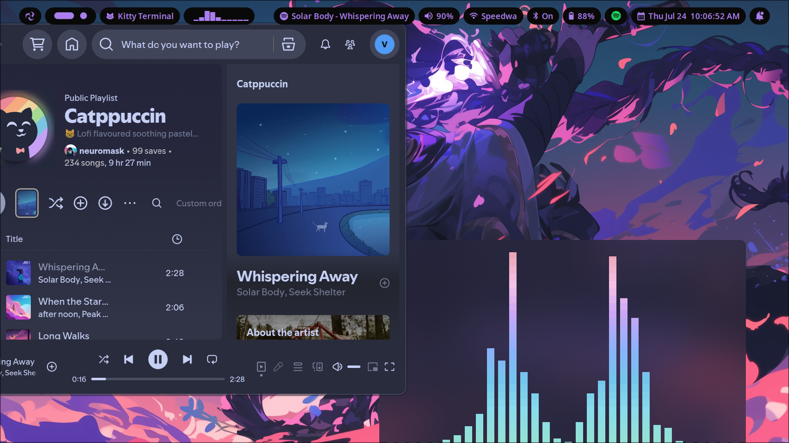
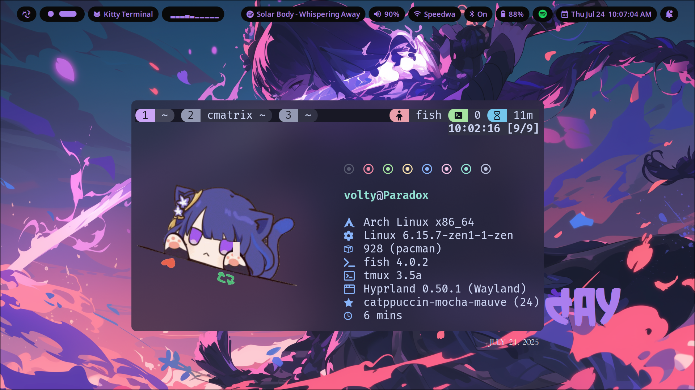
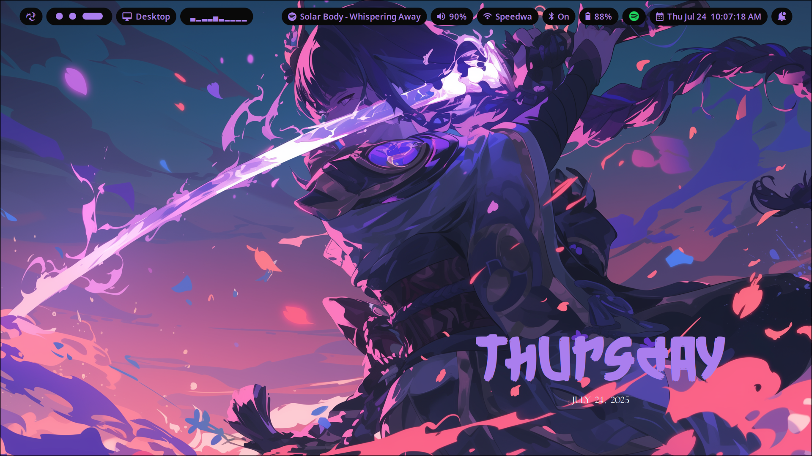

<p align="center">
<a href="https://github.com/voltyea/Amethyst">
  
  </a>
</p>

---

<p align="center">
  <sub><sup></sup></sub>
<a href="https://github.com/voltyea/Amethyst">
    <sup></sup></sub>
  </a>
  </p>

<div align="center">

https://github.com/user-attachments/assets/f6a3002f-5206-4d80-ad00-862645482c47

</div>

---

### 📦 Installation

> [!IMPORTANT]
> Run the installation script on a fresh and minimal installation of arch linux.
>Clone this repo in your home folder and run the installer script.

>[!CAUTION]
> If you are thinking of installing this setup alongside some other DE, please don't — it will probably break something.
>DO NOT use sudo to run the installation script.


### Arch Linux


```bash
git clone https://github.com/voltyea/Amethyst.git
cd Amethyst
sudo chmod +x install.sh
./install.sh
```

>[!NOTE]
>There is no support for nvidia drivers, so install it yourself.

### Notable Features

- You can change the wallpaper by double clicking on the screen.
- I use gnu stow to manage my dotfiles which are located in `$HOME/.local/amethyst/dotfiles/` directory. If you want to add your dotfiles to this directory and `stow` them, just use the `amethyst-cli` command. It will automatically add it to the amethyst dotfiles directory and symlink it in the right place.
  - Usage:
   - `amethyst-cli [options] <directory>`
 
   - `[options]`:
     
    - `-h` for help
    - `-add` to add a file or directory to the amethyst dotfiles directory and symlink it.
    - `remove` to remove the symlink and move the original file in it's place.
    - `cd` to change the directory to the amethyst dotfiles directory(this will open the dotfiles directory in a subshell, type `exit` to go back to where you where.)

- If you want to update your mirrorlist then just use the `update` command. This will update your official arch mirror and your chaotic aur mirrors.

- If you want to setup spicetify you can run the `spicetify.sh` script to do so after logging in to Spotify.

- Some HP and Lenovo laptops have an issue where the wifi gets disconnected after a few minutes, to solve this you can run the `rtw89.sh` script and - hopefully it will solve the issue.

### Gallery

<table align="center">
  <tr>
    <td colspan="4"></td>
  </tr>
  <tr>
    <td colspan="1"></td>
    <td colspan="1"></td>
  </tr>
</table>

---

Dotfiles repo:-
https://github.com/voltyea/dotfiles

Wallpapers repo:-
https://github.com/voltyea/my_wallpapers

[Here](KEYBINDS.md) are the keybinds.
